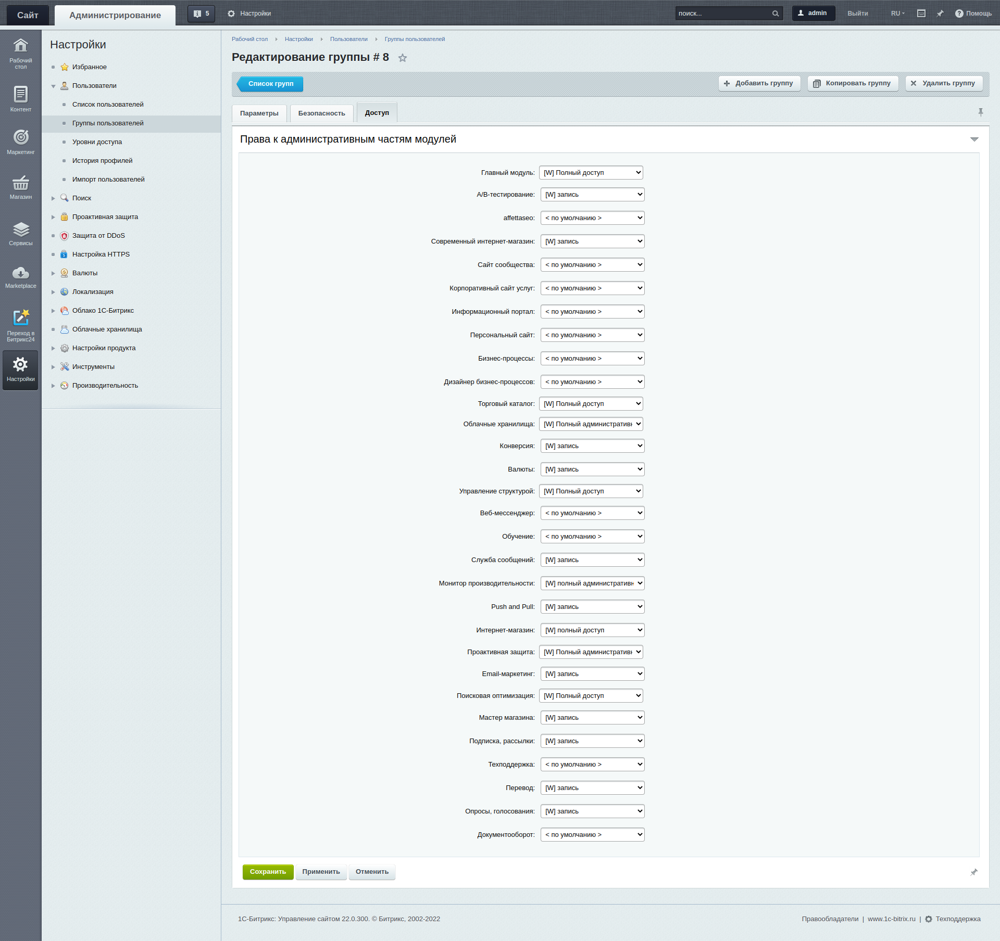
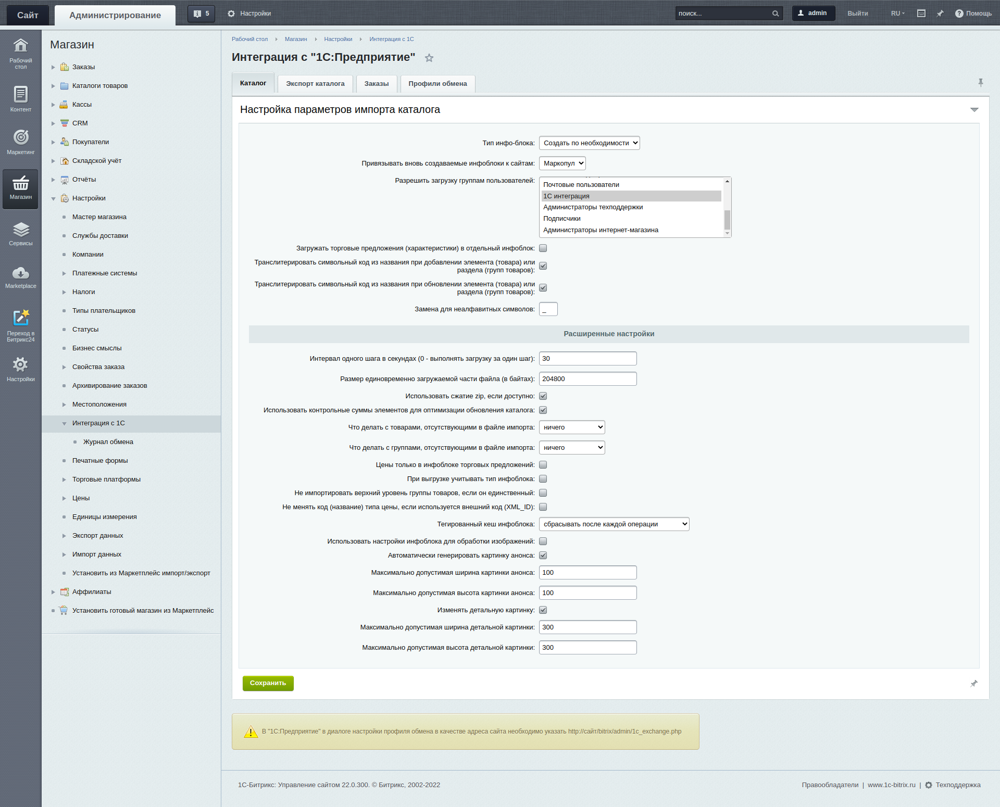
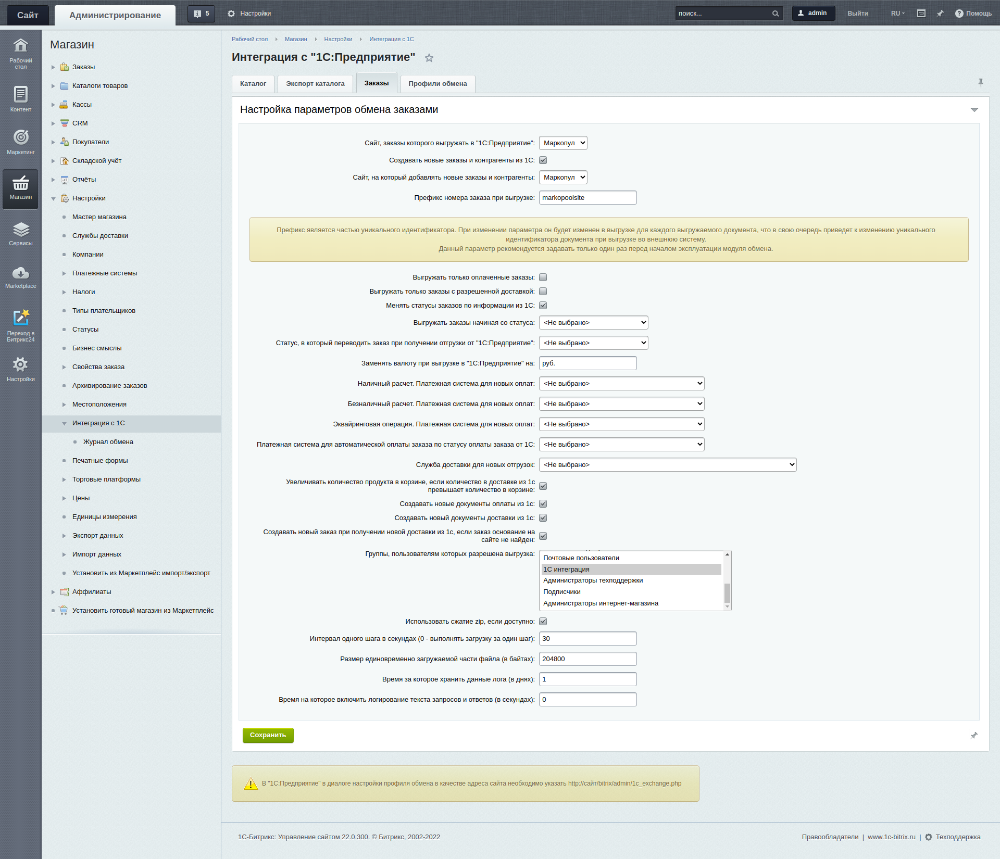
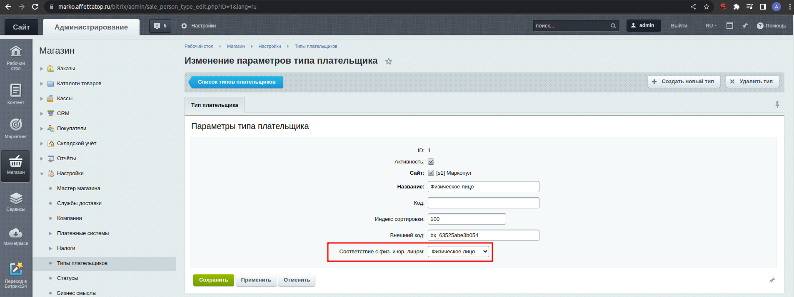
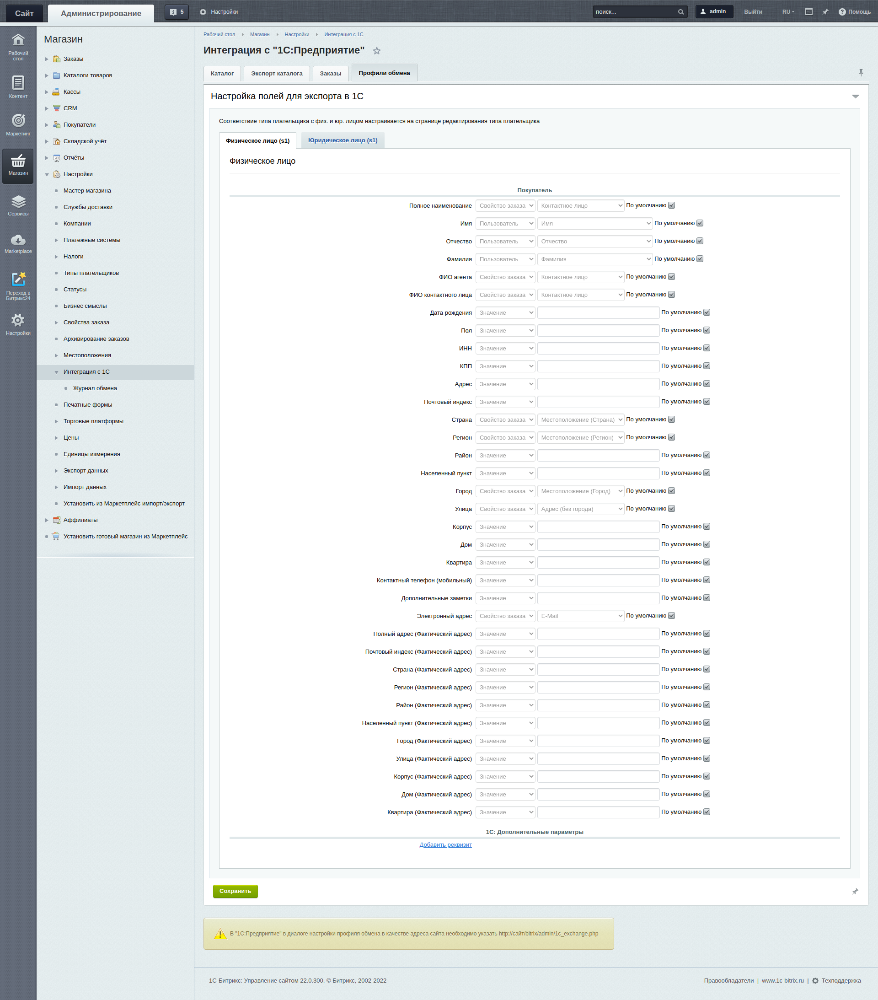
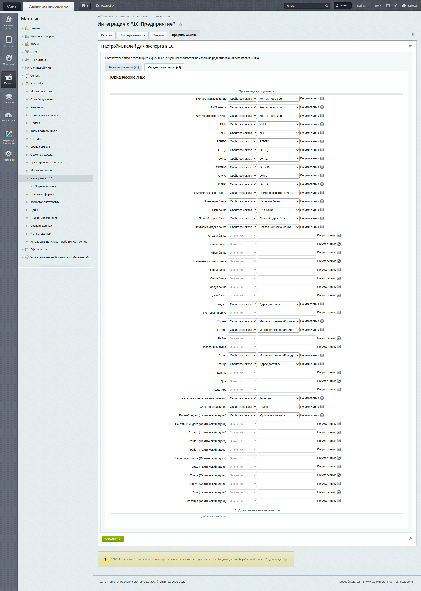
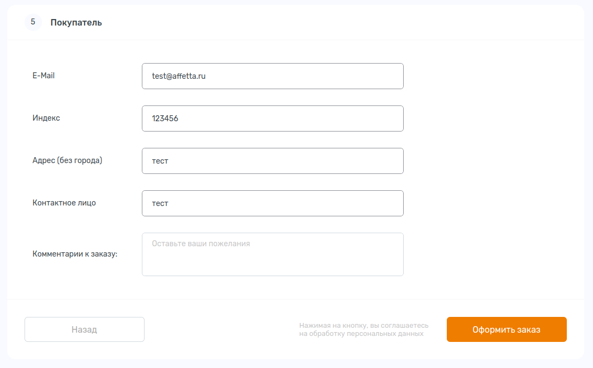
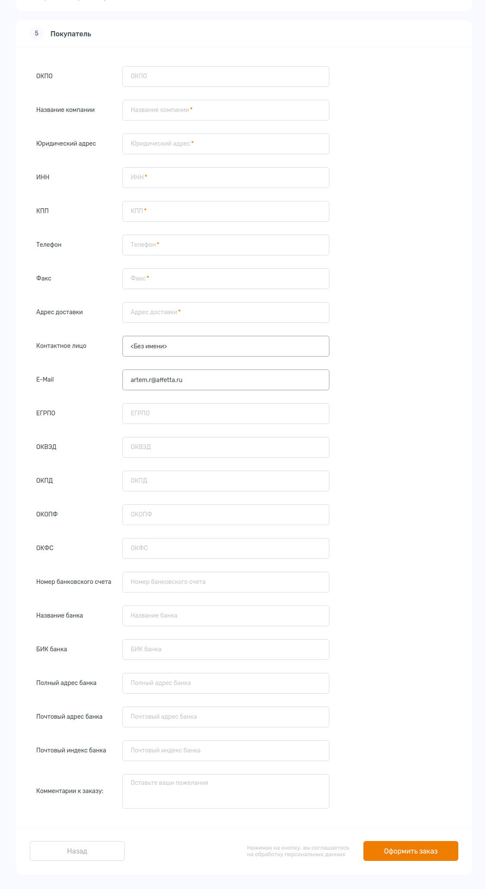

# ДВУСТОРОНЯЯ ИНТЕГРАЦИЯ 1С БИТРИКС С НАТИВНЫМ МОДУЛЕМ Интеграция с "1С:Предприятие"

Здесь список основных действий и примеров офрмления для интеграции\
Стоит помнить что здесь не пошаговая инструкция, а пример. Реальные настройки небходимые для решения ваших задачь могут отличиться от приведенных ниже.

## Импорт каталога

0. Необходимо создать группу пользователей 1С интеграция и назначить ей следующие права

1. Необходимо создать пользователя, под которым будет авторизовываться 1С при попытке выгрузки, добавить его в группу, созданную на прошлом этапе, и передать логин и пароль от него 1С-никам
2. На папку `/bitrix/admin/` для группы созданной на 0 этапе необходимо задать права на чтение
3. Примерные настройки для импорта каталога из 1С (обязательно отмечаем в "Разрешить загрузку группам пользователей" группу созданную на этапе 0)

`после применения следующих настроек просим выгрузить 1С-ников выгрузить каталог и чиним все ошибки которые обязательно возникнут.`

`если необходимо оставить текущую версию выгрузки`, а при следующей создать новую версию то в поле `Внешний код:` инфоблока необходимо стереть код который сгенерировала одинэска - тем самым отменить связку и при отмеченой функции создавать инфоблок по необходимости создастся новый инфоблок.\

`если необходимо посмотреть лог выгрузки`, то в `/bitrix/php_interface/dbconn.php` в конце добавляем
```angular2html
if(time() < strtotime('22.10.2022')) define("BX_CATALOG_IMPORT_1C_PRESERVE", true);
define("BX_COMPOSITE_DEBUG", true);
define("LOG_FILENAME", $_SERVER["DOCUMENT_ROOT"]."/upload/log.txt");
```
и просим выгрузку. только не профукате поменять дату. она чтобы не плодить логи

## Обмен заказами

4. Примерные настройки обмена заказами (отмечаем группу созданную на этапе 0 )

`Обмен заказами происходит в момент выгрузки.`
5. Настраиваем профили обмена. Профили обмена - это сопоставление полей заказа сайта с полями заказа 1с.\
если видим только надпись `Соответствие типа плательщика с физ. и юр. лицом настраивается на странице редактирования типа плательщика`, то необходимо перейти в настройки типов плательщиков и задать следующие поля. После появятся табы - физ лицо и юр лицо

   
Примерные настройки профиля обмена физического лица


Примерные настройки профиля обмена юридического лица


`Настроки профилей индивидуальны. От них зависит в какие поля будет приходить инфа из полей заказа. (Но можно и эти применить если не страшно)`

как выглядят поля заказа у физ лица у меня на фронте


как выглядят поля заказа у юр лица у меня на фронте


### если нужно 1с-ники говорят что заказы не приходят можно пруфонуть следущим

в репе есть файл `bx_1c_import.php`. его нужно кинуть в корень сайта и перейти на него в адресной строке. там жмем выгрузка заказов и проверить. если пишет дату последноего обмена, то обмен состоялся.  

#### удачи ребята, надеюсь вам попадутся хорошие 1с-ники